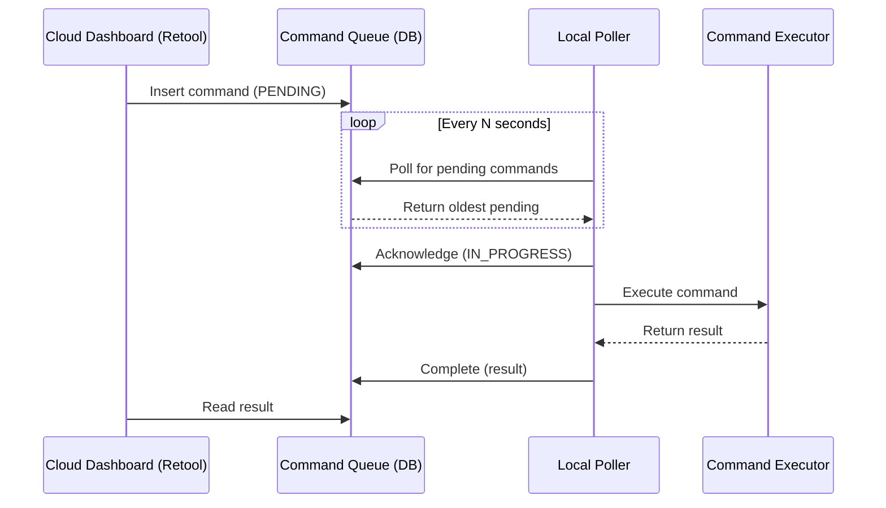

# Cloud-Local Command Bridge

Distributed command execution pattern for **cloud-to-local communication**. A local agent polls a cloud queue for commands, executes them behind the firewall, and reports results back — no exposed ports required.

## Architecture



## How It Works

1. **Cloud side** (e.g., Retool dashboard) inserts a command into a shared database queue
2. **Local bridge** polls the queue at a configurable interval
3. Bridge **acquires a distributed lock** to prevent duplicate processing
4. **Command executor** runs only pre-registered commands (security by design)
5. Result is written back to the queue for the cloud side to read
6. **Heartbeat** lets the cloud side know the bridge is alive

## Use Cases

- Triggering local scripts from a web dashboard
- Running scraping jobs from Retool without exposing the scraper machine
- Batch operations on on-premise data from cloud tools
- Executing maintenance tasks on firewalled servers

## Design Decisions

### Why Polling (not WebSocket/Webhooks)?

- **No exposed ports**: The local machine never accepts inbound connections
- **Firewall-friendly**: Works behind any NAT/firewall — only outbound HTTPS needed
- **Simple recovery**: If the bridge restarts, it just resumes polling
- **No infrastructure**: No message broker, no WebSocket server to maintain

### Why DB-Based Locking?

- Multiple bridge instances can run for high availability
- Only one instance processes each command (exactly-once semantics)
- Lock expiry handles crashed instances automatically
- Same DB used for the queue — no additional infrastructure

### Why Heartbeat Monitoring?

- Cloud side can detect dead bridges by stale heartbeats
- Enables alerting when a bridge goes offline
- Reports useful metrics: uptime, commands processed, current task

## Project Structure

```
cloud-local-command-bridge/
├── src/
│   ├── poller/          # Polls cloud DB for pending commands
│   ├── executor/        # Executes commands + registry of allowed commands
│   ├── locking/         # DB-based distributed lock
│   └── heartbeat/       # Health monitoring reporter
├── tests/               # 25+ unit tests (in-memory, no DB needed)
├── examples/            # Working demo
├── requirements.txt
└── README.md
```

## Quick Start

```bash
# Install dependencies
pip install -r requirements.txt

# Run tests
pytest tests/ -v

# Run the demo
python -m examples.bridge_demo
```

## Running Tests

```bash
pytest tests/ -v
```

All tests use in-memory implementations — no database or network required.

## Example Output

```
=== Cloud-Local Command Bridge Demo ===

Simulating cloud dashboard enqueueing commands...

Processing: PING (id=cmd-001)
  ✓ Result: PONG

Processing: STATUS (id=cmd-002)
  ✓ Result: {'status': 'running', 'platform': 'Windows', ...}

Processing: SCRAPE_PRICES (id=cmd-003)
  ✓ Result: Scraped 42 items from https://store.example.com

--- Heartbeat ---
  Host: MY-MACHINE
  Commands processed: 3
  Uptime: 0.05s
```

## Extending

Register your own commands:

```python
from src.executor.command_registry import CommandRegistry

registry = CommandRegistry()

registry.register(
    "IMPORT_DATA",
    handler=lambda path: f"Imported {path}",
    timeout=300.0,
    description="Import data from a local file",
)
```

## License

MIT
